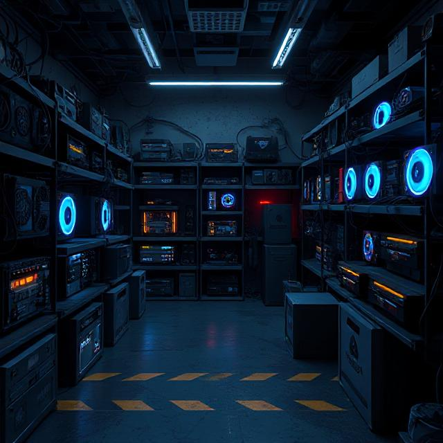

# 🔥 PSU SURVIVOR: TITANIUM HUNT 🔥

## 💀 ВЫЖИВИ В МИРЕ БЛОКОВ ПИТАНИЯ ИЛИ УМРИ ПЫТАЯСЬ 💀



## 🚀 ЧТО ЭТО ЗА ИГРА?

**PSU SURVIVOR: TITANIUM HUNT** - это МЕГА-ЭПИЧНАЯ игра, где ты управляешь персонажем, который должен собирать хорошие блоки питания и избегать плохих! Каждый титановый блок питания приближает тебя к победе, а каждый плохой блок - к поражению!

## 🎮 КАК ИГРАТЬ?

### Управление:
- **←** - Движение влево
- **→** - Движение вправо
- **ПРОБЕЛ** - Перезапуск игры после поражения

### Типы блоков:
- **🟢 GOOD** - Обычный хороший блок питания (+10 очков)
- **🔴 KCAS** - Плохой блок питания (-20 здоровья)
- **🟡 TITANIUM** - Супер-блок питания (+25 очков, +15 здоровья)

## 🔊 ЗВУКИ И ЭФФЕКТЫ

- Эпичная фоновая музыка для полного погружения
- Взрывные звуковые эффекты при столкновении с плохими блоками
- Приятные звуки "ням-ням" при сборе титановых блоков

## 🔧 УСТАНОВКА И ЗАПУСК

1. Клонируй репозиторий:
```bash
git clone git@github.com:koteyye/psu_survivor_titanium_hunt.git
```

2. Открой файл `index.html` в любом современном браузере

3. НАСЛАЖДАЙСЯ ИГРОЙ!

## 💯 ОСОБЕННОСТИ

- Реалистичная физика падающих блоков
- Система здоровья и очков
- Возможность перезапуска игры
- Визуальные эффекты взрывов
- Эпичный геймплей, от которого невозможно оторваться!

## 🏆 ЦЕЛЬ ИГРЫ

Набери как можно больше очков, собирая хорошие и титановые блоки питания, избегая плохих блоков. Твое здоровье начинается со 100 единиц. Игра заканчивается, когда здоровье падает до нуля.

## 🔥 УДАЧНОЙ ОХОТЫ ЗА ТИТАНОВЫМИ БЛОКАМИ! 🔥
