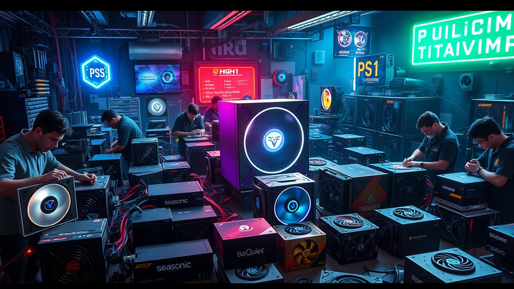

# 🔥 PSU SURVIVOR: TITANIUM HUNT 🔥

## 💀 ВЫЖИВИ В МИРЕ БЛОКОВ ПИТАНИЯ ИЛИ УМРИ ПЫТАЯСЬ 💀

## 🎮 [ИГРАТЬ ОНЛАЙН ПРЯМО СЕЙЧАС!](https://koteyye.github.io/psu_survivor_titanium_hunt/) 🎮



## 🚀 ЧТО ЭТО ЗА ИГРА?

**PSU SURVIVOR: TITANIUM HUNT** - это МЕГА-ЭПИЧНАЯ игра, где ты управляешь персонажем, который должен собирать хорошие блоки питания и избегать плохих! Каждый титановый блок питания приближает тебя к победе, а каждый плохой блок - к поражению! Выбери одного из трех уникальных персонажей, каждый со своей механикой игры!

## 🎮 КАК ИГРАТЬ?

### Управление:
- **←** - Движение влево
- **→** - Движение вправо
- **W** - Активация специальной способности персонажа
- **ПРОБЕЛ** - Перезапуск игры после поражения

### Типы блоков:
- **🟢 GOOD** - Обычный хороший блок питания (+10 очков)
- **🔴 KCAS** - Плохой блок питания (-20 здоровья)
- **🟡 TITANIUM** - Супер-блок питания (+25 очков, +15 здоровья)

## 👨‍👩‍👧 ПЕРСОНАЖИ И ИХ УНИКАЛЬНЫЕ МЕХАНИКИ

### 🤖 Товарищ С. (КЛАССИЧЕСКИЙ)
- Стандартная механика: собирай хорошие блоки для очков, избегай плохих
- Шкала здоровья: начинается со 100 единиц
- Особенность: сбалансированный персонаж для новичков

### 🔥 Вован-Алиэкспресс (ЯРОСТЬ)
- Уникальная механика: шкала ярости, которая наполняется при сборе блоков
- Активная способность (W): активирует режим ярости, увеличивая получаемые очки
- Особенность: рискованный геймплей с высокими наградами

### 💰 Кролик-Шнырь Облигац (ИНВЕСТИЦИИ)
- Уникальная механика: инвестиционный график и корзина блоков
- Шкала денег: тратится при сборе блоков, наполняя корзину
- Активная способность (W): продажа корзины по текущему курсу на графике
- Особенность: следи за графиком и продавай в нужный момент для максимальной прибыли

## 🔊 ЗВУКИ И ЭФФЕКТЫ

- Эпичная фоновая музыка для полного погружения
- Взрывные звуковые эффекты при столкновении с плохими блоками
- Приятные звуки "ням-ням" при сборе титановых блоков
- Уникальные реплики для каждого персонажа

## 🔧 УСТАНОВКА И ЗАПУСК

### Онлайн-версия:
Играй прямо в браузере без установки: [https://koteyye.github.io/psu_survivor_titanium_hunt/](https://koteyye.github.io/psu_survivor_titanium_hunt/)

### Локальная установка:
1. Клонируй репозиторий:
```bash
git clone git@github.com:koteyye/psu_survivor_titanium_hunt.git
```

2. Открой файл `index.html` в любом современном браузере

3. НАСЛАЖДАЙСЯ ИГРОЙ!

## 💯 ОСОБЕННОСТИ

- Три уникальных персонажа с разными механиками игры
- Реалистичная физика падающих блоков
- Система здоровья и очков
- Инвестиционный график для Кролика-Шныря Облигаца
- Шкала ярости для Вована-Алиэкспресса
- Активные способности персонажей
- Возможность перезапуска игры
- Визуальные эффекты взрывов
- Эпичный геймплей, от которого невозможно оторваться!

## 🏆 ЦЕЛЬ ИГРЫ

Набери как можно больше очков, используя уникальные механики выбранного персонажа. Каждый персонаж имеет свой путь к победе:
- Товарищ С.: просто собирай хорошие блоки и избегай плохих
- Вован-Алиэкспресс: собирай блоки балансируя с яростью
- Кролик-Шнырь Облигац: следи за инвестиционным графиком и продавай корзину на пике

## 🔥 УДАЧНОЙ ОХОТЫ ЗА ТИТАНОВЫМИ БЛОКАМИ! 🔥
